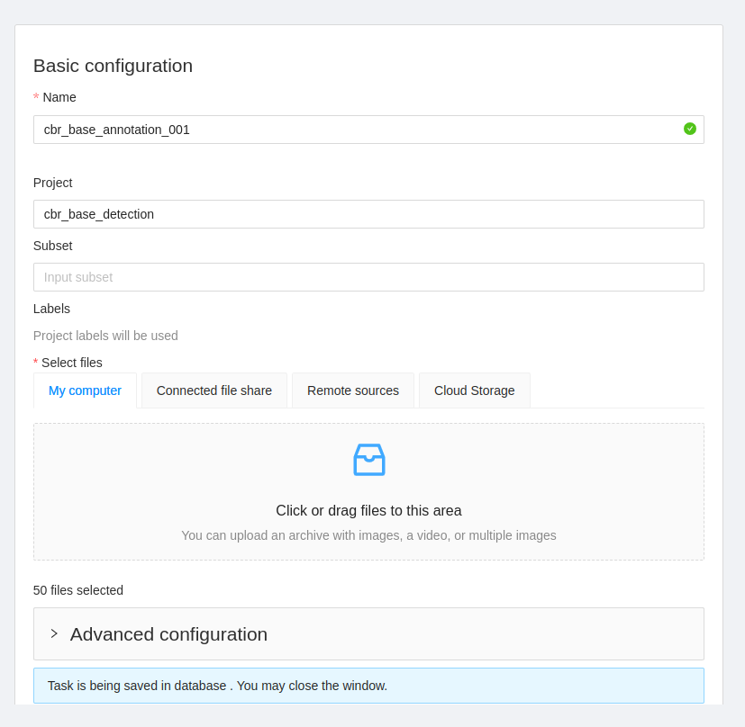

# Step 1: Mount Google Drive
from google.colab import drive
drive.mount('/content/gdrive')

# Step 2: Install Required Libraries
!pip install torch torchvision
!pip install 'git+https://github.com/ultralytics/yolov5.git'

# Step 3: Download Pre-trained Weights (Optional, if you haven't trained your model with yolov5)
# !wget https://github.com/ultralytics/yolov5/releases/download/v5.0/yolov5s.pt

# Step 4: Load YOLOv5 Model with Custom Weights
import torch

# Replace 'path/to/your/weights/best' with the correct path in your Google Drive
custom_weights_path = '/content/gdrive/MyDrive/path/to/your/weights/best'
model = torch.hub.load('ultralytics/yolov5:v5.0', 'custom', path=custom_weights_path).autoshape()

# Step 5: Real-time Object Detection
import cv2
from IPython.display import display, Image
import numpy as np

# Start webcam capture
cap = cv2.VideoCapture(0)

try:
    while True:
        # Capture frame-by-frame
        ret, frame = cap.read()

        # Perform YOLOv5 inference
        results = model(frame)

        # Process detection results
        for pred in results.pred:
            class_labels = pred[:, -1].cpu().numpy()
            bounding_boxes = pred[:, :-1].cpu().numpy()

            # Filter detections based on confidence threshold
            confidence_threshold = 0.5
            filtered_indices = np.where(class_labels > confidence_threshold)[0]
            filtered_boxes = bounding_boxes[filtered_indices]

            # Draw bounding boxes on the frame
            for box in filtered_boxes:
                box = list(map(int, box))
                frame = cv2.rectangle(frame, (box[0], box[1]), (box[2], box[3]), (0, 255, 0), 2)

        # Display the frame
        _, img_encoded = cv2.imencode('.jpg', frame)
        display(Image(data=img_encoded.tobytes()))

except KeyboardInterrupt:
    # Release the camera and close the display window on interrupt
    cap.release()
    cv2.destroyAllWindows()
